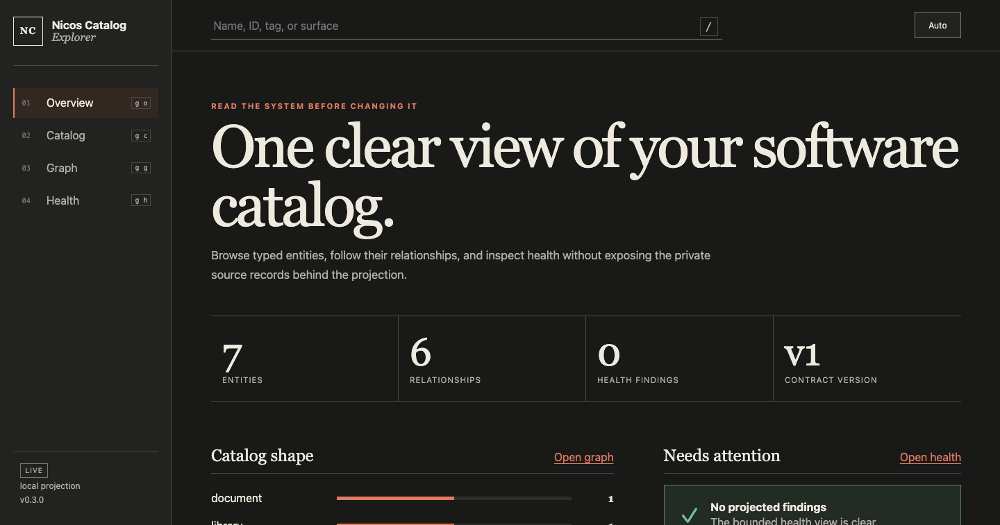
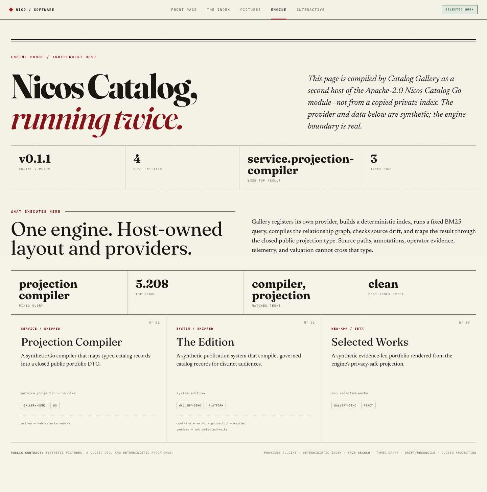

# Nicos Catalog

[](https://pkg.go.dev/github.com/nstranquist/nicos-catalog)
[](https://github.com/nstranquist/nicos-catalog/actions/workflows/ci.yml)
[](https://goreportcard.com/report/github.com/nstranquist/nicos-catalog)
[](LICENSE)

Nicos Catalog is a local software-catalog engine and read-only Explorer. It
models repositories, services, products, documents, and their relationships.
A host supplies the folder layout and data providers. The engine validates,
indexes, searches, graphs, and checks the catalog for drift.

Explorer gives people and agents the same bounded catalog view. It runs from
the Go binary and needs no Node runtime. A static export uses the closed public
projection and can be hosted without a catalog daemon.

The public core leaves out personal telemetry, business valuation, private
query text, runtime credentials, and host-only portfolio policy. Those stay
in host adapters.

## Showcase






The Explorer and Gallery images use synthetic fixtures. A CLI walk of the same
demo is in [screenshots/](screenshots/).

## Install

Requires Go 1.24 or newer.

```sh
go install github.com/nstranquist/nicos-catalog/cmd/nicos-catalog@v0.3.0
nicos-catalog version --expect v0.3.0
```

For a source checkout:

```sh
go test ./...
go install ./cmd/nicos-catalog
```

## Five-minute Explorer

The built-in demo contains synthetic entities only and writes to a temporary
directory. The command removes that directory when the server stops.

```sh
nicos-catalog demo --ui --open
```

Explorer listens on a random loopback port. Press `Ctrl-C` to stop it. Use
`demo --ui` without `--open` when a browser must not open automatically.

The JSON and terminal demo remain available:

```sh
nicos-catalog demo
nicos-catalog --json demo --query "developer platform"
```

## Start an authored catalog

Run these commands in an empty project directory:

```sh
nicos-catalog init --template sample
nicos-catalog validate
nicos-catalog reindex
nicos-catalog serve --open
```

`init` writes only missing starter files. `serve` is read-only and accepts a
loopback address only.

To exercise an authored corpus from this repository:

```sh
nicos-catalog --root . --corpus demo/catalog validate
nicos-catalog --root . --corpus demo/catalog reindex
nicos-catalog --root . --corpus demo/catalog search --limit 3 "ownership graph"
nicos-catalog --root . --corpus demo/catalog graph
nicos-catalog --root . --corpus demo/catalog drift
nicos-catalog --root . --corpus demo/catalog --json project --visibility public --allow-hosts example.com
```

## Export a static public Explorer

Reindex the corpus before an export. Then select the public visibility boundary
explicitly:

```sh
nicos-catalog reindex
nicos-catalog export explorer --out ./public-catalog --visibility public --allow-hosts example.com
```

The command writes one deterministic site. It rejects an unsafe output path,
a symlink path, and a non-Explorer directory. The export contains projected
entities only. See [the static export guide](docs/static-export.md).

## Connect an agent

Start the read-only stdio MCP server after you build the index:

```sh
nicos-catalog mcp --stdio
```

The server exposes bounded search, page, graph, and health tools. It has no
write tool and sends no telemetry. See [the MCP guide](docs/mcp.md).

GitHub-local collation is a host command, off until `<config>/settings.yaml`
names a profile and sets `github.collation.enabled: true`. It walks local
clones only; registered repos emit records, and `--apply` rebuilds the derived
index without mutating those clones. With collation on, `reindex` keeps those
records instead of wiping them. Settings can bound the walk (`max_repos`,
`skip_dir_names`). `--apply` writes a snapshot; `--from-snapshot` reads it
without walking. `--profile-repos` fills the missing-clone bucket. Factory
enrollment gaps are observe-only (`--enroll-manifest` / `ndev catalog external gaps`).

```sh
nicos-catalog --json collate
nicos-catalog --json collate --apply
```

## Host contract

```go
layout, _ := (catalog.Layout{
    CorpusDir: "catalog",
    ConfigDir: ".catalog",
    CacheDir: ".catalog/cache",
    SidecarDataDir: ".catalog/sidecars",
}).Resolve(hostRoot)

engine, _ := catalog.New(layout, catalog.WithProviders(myProvider))
_, _ = engine.Reindex(ctx)
results, _ := engine.Search("ownership graph", catalog.SearchOptions{Limit: 5})
```

A provider implements one small interface:

```go
type Provider interface {
    Name() string
    Provide(context.Context, catalog.Layout) ([]catalog.Record, error)
}
```

`FilesystemProvider` handles YAML, JSON, and Markdown with YAML frontmatter. Its
`Strict` mode rejects unknown fields, malformed frontmatter, trailing
documents, and records without IDs; the CLI enables strict mode. It skips
generated/cache directories plus `_archive` by default; hosts can add directory
names through `ExcludeDirs`.
`StaticProvider` supports embedded fixtures and API-backed hosts. Provider output
is normalized and sorted. Duplicate IDs are rejected, even across providers.

## Privacy boundary

`ProjectPublic` produces a closed `PublicEntity` export. It cannot encode source
paths, annotations, owner fields, telemetry, query text, valuation, or sidecar
data. Hosts may further restrict visibility, kinds, tags, URL hosts, and summary
length. Publication should use this export rather than filtering the private
index after serialization.

## Why this exists

Large personal and organizational ecosystems become hard to reason about long
before they become large enough to justify a heavyweight service catalog. Nicos
Catalog keeps the data portable and reviewable while still providing the pieces
that make a catalog operational: provider boundaries, deterministic derived
state, search, typed relationships, and drift enforcement.

See [the Explorer guide](docs/explorer.md),
[the performance guide](docs/performance.md),
[docs/architecture.md](docs/architecture.md), and
[SECURITY.md](SECURITY.md).

## Release state

This checkout can be build-ready before `v0.3.0` is public. A local build is
not a release. A release is not deployment, launch, adoption, or revenue. The
[release candidate record](docs/releases/v0.3.0.md) lists each external gate.

## License

Apache-2.0.

## Migrating from v0.1.x

| v0.1.x | v0.2.0 |
| --- | --- |
| `catalog.New(layout, p1, p2)` | `catalog.New(layout, catalog.WithProviders(p1, p2))` |
| `engine.LoadIndex()` | `engine.LoadIndex(ctx)` |
| `engine.Search(q, opts)` | `engine.Search(ctx, q, opts)` |
| `catalog.ProjectPublic(index, policy)` | `catalog.ProjectPublic(ctx, index, policy)` |
| `engine.Reconcile(ctx, true)` | `engine.Reconcile(ctx, catalog.ReconcileApply)` |
| `catalog.Version` | `catalog.Version()` |
| `Visibility: "public"` | `Visibility: catalog.VisibilityPublic` |
| `report.Warnings []string` | `report.Warnings []catalog.ValidationIssue` |

`Index.SchemaVersion` advanced to 2, so the first v0.2.0 run rebuilds any
existing index. `Drift` reports `index_schema_mismatch` instead of failing, so
this surfaces as a reindex prompt rather than an error. `Record.Digest` is now
per-entity; the previous whole-payload value is `Record.SourceDigest`.

Errors are now typed. Match sentinels with `errors.Is` and recover detail with
`errors.As` rather than comparing message text:

```go
if errors.Is(err, catalog.ErrIndexMissing) { /* run reindex */ }

var policy *catalog.PolicyError
if errors.As(err, &policy) {
    log.Printf("entity %s field %s violated %s", policy.EntityID, policy.Field, policy.Rule)
}
```

See [`docs/api-stability.md`](docs/api-stability.md) for the versioning policy.
